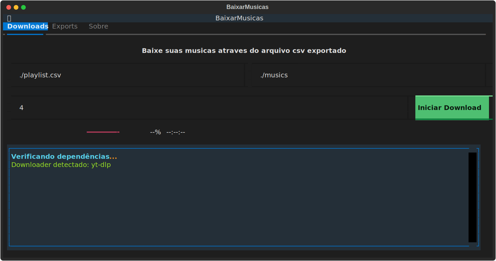
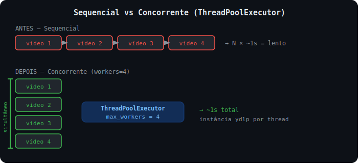

# Baixar Musicas

Baixe suas playlists do YouTube ou Spotify de forma descomplicada.

# Aviso Legal (Disclaimer)
Este projeto foi desenvolvido estritamente para fins educacionais e de estudo. O código aqui disponibilizado não deve, sob nenhuma circunstância, ser utilizado para fins comerciais, obtenção de lucro ou qualquer atividade que viole os Termos de Serviço das plataformas envolvidas.

Isenção de Responsabilidade: Eu me isento totalmente de qualquer responsabilidade sobre como este software será utilizado. O uso desta ferramenta é de sua inteira responsabilidade, bem como quaisquer consequências ou danos decorrentes do seu uso indevido.

Uso com Moderação: Utilize este programa com moderação e responsabilidade. O excesso de requisições ou o uso inadequado pode ser detectado pelos serviços (como YouTube e Spotify), resultando em bloqueios de IP, restrições ou banimento definitivo da sua conta.

# Ferramentas utilizadas
* [Python](https://pypi.org/project/yt-dlp/?utm_source=https://github.com/ofcoliva)
* [FFMPEG](https://ffmpeg.org/?utm_source=https://github.com/ofcoliva)
* [pip](https://python.land/virtual-environments/installing-packages-with-pip?utm_source=https://github.com/ofcoliva) ou [uv](https://docs.astral.sh/uv/?utm_source=https://github.com/ofcoliva)
* [yt-dlp](https://pypi.org/project/yt-dlp/?utm_source=https://github.com/ofcoliva)
* [textual](https://textual.textualize.io/?utm_source=https://github.com/ofcoliva)
* [spotipy](https://spotipy.readthedocs.io/en/2.26.0/?utm_source=https://github.com/ofcoliva)
* [tzdata](https://pypi.org/project/tzdata/?utm_source=https://github.com/ofcoliva)

# Siga os passos abaixo para execução do programa.

## Clone ou baixe o repositório

```powershell
git clone https://github.com/ofcoliva/baixar-musicas
```

## Entre no diretório
```poweshell
cd baixar-musicas
```

## Instale o FFMPEG
```powershell
winget install ffmpeg
```

## Istale o UV
Ou use o PIP se preferir
```powershell
powershell -ExecutionPolicy ByPass -c "irm https://astral.sh/uv/install.ps1 | iex"
```

## Sincronizar Dependências
```bash
uv sync
```

*caso o venv ainda esteja desativado, utilize o comando abaixo*
```powershell
.\.venv\Scripts\activate
```

## Executar aplicacao
```bash
python main.py
```

Logo após a execução do comando uma tela como a de baixo será exibida com parâmetros configurados por padrão.



# Otimização com concorrencia explicada em uma imagem


